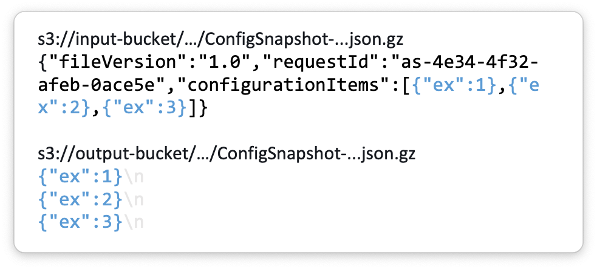
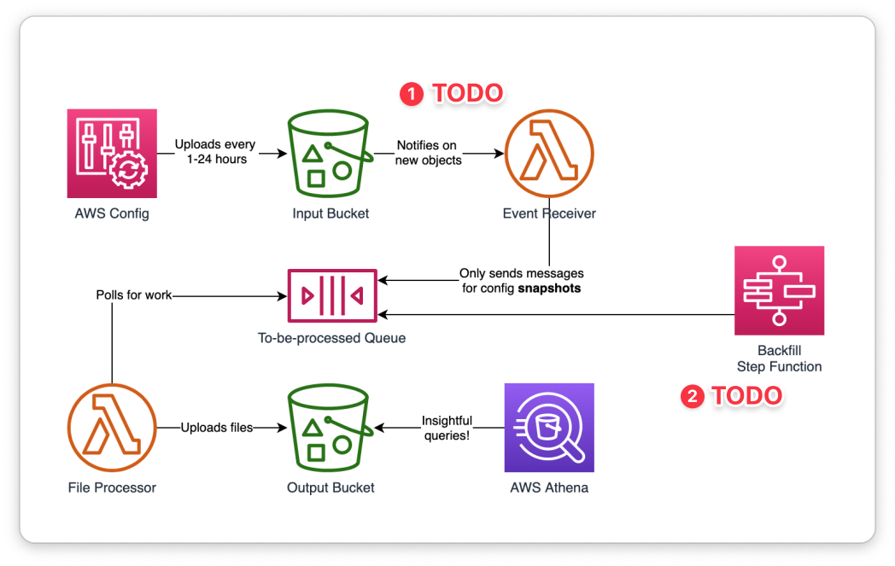

# `config2jsonlines`

[AWS Config](https://aws.amazon.com/config/) is a service that can record the
configuration of all your resources in AWS. It can deliver configuration "snapshots"
on a regular schedule to an S3 bucket to allow you to do further analysis.

This naturally pairs well with [AWS Athena](https://aws.amazon.com/athena/), a
service that allows you to perform ad hoc SQL queries on files stored in S3. Athena
can query arbitrary JSON, so it _should_ have no problem with files generated
by AWS Config, right? In fact, the AWS blog even has an article:
[_How to query your AWS resource configuration states using AWS Config and Amazon Athena_.](https://aws.amazon.com/blogs/mt/how-to-query-your-aws-resource-configuration-states-using-aws-config-and-amazon-athena/)

The examples in the blog post work for small AWS accounts, but in large accounts the 
queries will consistently fail. I don't know enough about Athena to be certain, but I suspect the 
`CROSS JOIN UNNEST(configurationitems)` part of the query is loading the entire
decompressed config snapshot into memory - which in my case is more than a gigabyte -
and runs out of memory.

To work around this, I created an AWS Lambda-powered app that "unnests" the config
snapshot JSON in advance - rather than being a gigabyte-long JSON array on one line,
it is instead represented in [JSON lines](http://jsonlines.org/). This format is
supported by AWS Athena and I've yet to write a query that fails in the same way 
that the original files do. This is a visual depiction of the transformation:

There are two happy coincidental benefits to this as well:

* The owner of the new S3 objects is the AWS account, so you have no problems
  allowing cross-account Athena access to the files.
* Querying the files no longer requires `CROSS JOIN UNNEST(configurationitems)`,
  which I always found confusing.
  
## Deployment

TODO.

## Implementation

Some people are into this sort of thing. 

1. AWS SAM doesn't support configuring S3 event notifications for a bucket defined
   outside of the same template as the function. So this part currently needs to be
   done manually. A CloudFormation custom resource would be nicer.

2. It would be nice to be "backfill" historical Config snapshots that were uploaded
   to the input bucket before this solution was deployed. (This is actually why I 
   went with the indirection of the SQS queue in the middle.)

## FAQ

**Why Go?**

Given that a ~40MB gzipped Config snapshot can decompress to 1GB+ and there will be
accounts out there bigger than mine, I decided that this needed to be implemented
in a "streaming" fashion, i.e. it can process a file without having to decompress
or parse the entire JSON first. I didn't know how to do this in any other language.

**Are you going to be embarrassed to find out that Athena works perfectly fine
with big Config snapshots and you just did something wrong?**

Wow, it's like you're in my head. But to answer your question: yes it'll be 
embarrassing, but I'll have learned something new and I'll get to delete code,
which is the only thing more pleasurable than writing code.

**Are those questions really _frequently_ asked?**

No, but I couldn't think of another format to relay that information. My apologies
for any deception.
 